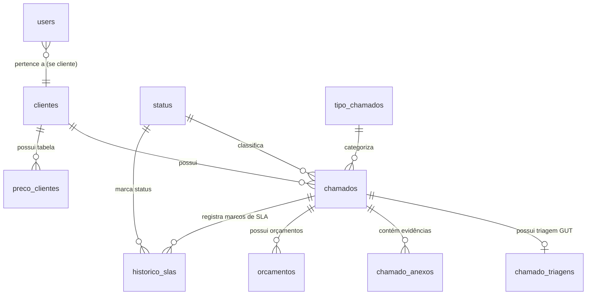

# Documento de Requisitos Técnicos e Arquitetura: Abertura e Triagem de Chamados / Ordens de Serviço (OS)

**Projeto:** Sistema de Gestão de Chamados e Abertura de OS — OiCram  
**Ambiente / Stack:** Laravel 12.x (PHP 8.2+) | MySQL 8.0 (Docker) | Blade + Tailwind CSS v4 + Alpine.js | Vite 6  
**Escopo Prioritário:** Módulo de Abertura, Triagem Automatizada (GUT) e Registro de Chamados/OS

---

## 1. Visão Geral e Contexto do Projeto

Este documento especifica técnica e funcionalmente o módulo de **Abertura e Triagem de Chamados / Ordens de Serviço (OS)** para a empresa OiCram. O objetivo central é eliminar a informalidade de atendimentos dispersos (via WhatsApp, mensagens soltas e e-mails) no relacionamento com o prestador de serviços Márcio Pereira.

### 1.1 Diagnóstico da Base Atual do Projeto
A análise da base de código existente (`projetoLaravel`) identificou os seguintes alinhamentos arquiteturais essenciais:
* **Framework:** Laravel 12.x (`laravel/framework: ^12.0`, PHP 8.2+).
* **Banco de Dados:** MySQL 8.0 executando em container Docker (`laravel_mysql`, porta `3306`), administrado via phpMyAdmin (`localhost:8080`), conforme `docker-compose.yml` e `README.md`.
* **Migrations Existentes:** A base já possui 9 migrações estruturadas voltadas ao ciclo de chamados:
  * `status` (dicionário de status do chamado);
  * `clientes` (cadastro de empresas clientes e seus perfis);
  * `tipo_chamados` (categorização de chamados);
  * `preco_clientes` (precificação horária vinculada ao cliente);
  * `chamados` (entidade central do chamado / OS);
  * `chamado_triagens` (registro da análise GUT — Gravidade, Urgência, Tendência);
  * `chamado_anexos` (arquivos e capturas de tela vinculadas);
  * `orcamentos` (registro de valores e propostas geradas);
  * `historico_slas` (linha do tempo de transições de status e auditoria de prazos).
* **Camada Visual:**
  * O projeto utiliza **Vite 6** com **Tailwind CSS v4** (`@tailwindcss/vite: ^4.0.0`, `@import "tailwindcss"` em `resources/css/app.css`).
  * O layout inicial (`resources/views/layouts/main.blade.php`) continha resquícios de template legado de eventos com Bootstrap 5. Deve ser padronizado para o layout oficial OiCram utilizando `@vite(['resources/css/app.css', 'resources/js/app.js'])` e componentes Tailwind CSS com Alpine.js para o assistente de triagem.
* **Autenticação de Usuários:**
  * É necessária a criação/reintegração da tabela `users` ligada à tabela `clientes` (`cliente_id` FK opcional para clientes corporativos) e sinalizador de permissão/papel (`role` ou `is_admin` para Márcio/equipe técnica).

---

## 2. Mapeamento do Domínio e Esquema Relacional

Para garantir total conformidade com a base já migrada, os nomes de tabelas, campos e Models Eloquent devem seguir estritamente as migrações criadas no diretório `database/migrations/`:



### 2.1 Modelos Eloquent e Estrutura de Tabelas

1. **`Cliente` (`clientes`)**
   * `id`: Chave primária.
   * `nome_empresa`: Razão social ou nome fantasia da empresa (string 100).
   * `perfil`: Descrição ou perfil operacional do cliente (string 255, nullable).
   * Relacionamentos: `hasMany(Chamado::class)`, `hasOne(PrecoCliente::class)`, `hasMany(User::class)`.

2. **`PrecoCliente` (`preco_clientes`)**
   * `id`: Chave primária.
   * `cliente_id`: Chave estrangeira (`clientes.id`, cascade).
   * `valor_hora`: Taxa horária contratada (decimal 10,2).
   * Relacionamento: `belongsTo(Cliente::class)`.

3. **`Status` (`status`)**
   * `id`: Chave primária.
   * `descricao`: Nome do status (string 50).
   * Valores padronizados via Seeder:
     * `ABERTO` (recém-aberto pelo cliente, aguardando início da triagem);
     * `EM_TRIAGEM` (sob avaliação técnica/GUT);
     * `EM_ANALISE` (análise de escopo e esforço pelo Márcio);
     * `PENDENTE_CLIENTE` (aguardando resposta ou evidência adicional — pausa contagem de SLA);
     * `ORCAMENTO_GERADO` (pré-orçamento emitido e aguardando aprovação);
     * `APROVADO` (aprovado para execução);
     * `EM_DESENVOLVIMENTO` (em implementação técnica);
     * `EM_QA` (em testes e homologação);
     * `CONCLUIDO` (atendimento finalizado e entregue);
     * `CANCELADO` (cancelado ou recusado).

4. **`TipoChamado` (`tipo_chamados`)**
   * `id`: Chave primária.
   * `descricao`: Tipo de solicitação (string 50).
   * Valores padronizados via Seeder:
     * `Defeito / Bug`;
     * `Melhoria / Nova Funcionalidade`;
     * `Dúvida / Suporte Técnico`;
     * `Consultoria / Ajuste Emergencial`.

5. **`Chamado` (`chamados`) — Entidade Central da OS**
   * `id`: Chave primária.
   * `cliente_id`: Chave estrangeira (`clientes.id`).
   * `status_id`: Chave estrangeira (`status.id`).
   * `tipo_chamado_id`: Chave estrangeira (`tipo_chamados.id`).
   * `descricao`: Descrição rica e contextualizada do problema (text).
   * `criticidade_cliente`: Percepção inicial do cliente (`BAIXA`, `MEDIA`, `ALTA`, `CRITICA`).
   * `aberto_em`: Registro cronológico da submissão (dateTime, default current).
   * `inicio_planejamento` / `fim_planejamento`: Marcos de planejamento (dateTime, nullable).
   * `inicio_dev` / `fim_dev`: Marcos de desenvolvimento (dateTime, nullable).
   * `inicio_qa` / `fim_qa`: Marcos de validação/testes (dateTime, nullable).
   * `fechado_em`: Conclusão do chamado (dateTime, nullable).
   * Relacionamentos:
     * `belongsTo(Cliente::class)`
     * `belongsTo(Status::class)`
     * `belongsTo(TipoChamado::class)`
     * `hasOne(ChamadoTriagem::class)`
     * `hasMany(ChamadoAnexo::class)`
     * `hasMany(Orcamento::class)`
     * `hasMany(HistoricoSla::class)`

6. **`ChamadoTriagem` (`chamado_triagens`) — Matriz GUT**
   * `id`: Chave primária.
   * `chamado_id`: Chave estrangeira (`chamados.id`, cascade).
   * `gut_gravidade`: Gravidade de 1 a 5 (tinyInteger).
   * `gut_urgencia`: Urgência de 1 a 5 (tinyInteger).
   * `gut_tendencia`: Tendência de 1 a 5 (tinyInteger).
   * `pontuacao`: Resultado calculado: $\text{Pontuação} = G \times U \times T$ (smallInteger, escala 1 a 125).
   * Relacionamento: `belongsTo(Chamado::class)`.

7. **`ChamadoAnexo` (`chamado_anexos`)**
   * `id`: Chave primária.
   * `chamado_id`: Chave estrangeira (`chamados.id`, cascade).
   * `nome_arquivo`: Nome original do arquivo (string 255).
   * `tipo_arquivo`: Extensão / MIME type (string 100, nullable).
   * `caminho`: Caminho de armazenamento no storage (string 500).
   * `tamanho`: Tamanho em bytes (integer, nullable).
   * Relacionamento: `belongsTo(Chamado::class)`.

8. **`Orcamento` (`orcamentos`)**
   * `id`: Chave primária.
   * `chamado_id`: Chave estrangeira (`chamados.id`, cascade).
   * `valor_total`: Valor consolidado da proposta (decimal 10,2).
   * `link_documento`: URL ou path de PDF/proposta (string 500, nullable).
   * Relacionamento: `belongsTo(Chamado::class)`.

9. **`HistoricoSla` (`historico_slas`)**
   * `id`: Chave primária.
   * `chamado_id`: Chave estrangeira (`chamados.id`, cascade).
   * `status_id`: Chave estrangeira (`status.id`).
   * `registrado_em`: Carimbo de data/hora do evento (timestamp, default current).
   * Relacionamento: `belongsTo(Chamado::class)`, `belongsTo(Status::class)`.

10. **`User` (`users`) — Autenticação e Vínculo com Cliente**
    * `id`, `name`, `email`, `password`.
    * `cliente_id` (FK nullable -> `clientes.id`): Preenchido quando o usuário for representante de um cliente.
    * `role`: `'admin'` (Márcio/equipe) ou `'cliente'` (string 20, default `'cliente'`).

---

## 3. Requisitos Funcionais (RF)

### [RF-01] Formulário de Abertura de Chamado pelo Cliente
* **Descrição:** Interface web moderna em Blade + Tailwind CSS permitindo que o cliente autenticado cadastre um novo chamado/OS.
* **Entradas:**
  * Identificação do Cliente: Obtida automaticamente via usuário logado (`Auth::user()->cliente_id`).
  * Tipo de Chamado: Seleção via `tipo_chamados` (`Defeito`, `Melhoria`, `Dúvida`, etc.).
  * Criticidade Declarada: Nível declarado pelo cliente (`Baixa`, `Média`, `Alta`, `Crítica`).
  * Descrição: Texto detalhado da demanda (mínimo de 20 caracteres obrigatórios).
* **Validação:** Realizada via `StoreChamadoRequest`.
* **Ações Automáticas:**
  * O chamado é gravado com status inicial `ABERTO`.
  * Criação automática do primeiro registro em `historico_slas` apontando para o status `ABERTO` com `registrado_em = now()`.

### [RF-02] Assistente de Triagem Interativo (Wizard Alpine.js & Matriz GUT)
* **Descrição:** Componente interativo integrado ao formulário em etapas guiadas para orientar o cliente e evitar chamados vagos.
* **Perguntas de Triagem Dinâmicas:**
  * *Gravidade (Impacto no negócio):* 1 (Mínimo/Cosmético) a 5 (Operação parada / Perda financeira).
  * *Urgência (Necessidade de prazo):* 1 (Pode aguardar sprint futura) a 5 (Resolução imediata necessária).
  * *Tendência (Piora com o tempo):* 1 (Não se agrava) a 5 (Vai degradar rapidamente o banco/serviço).
* **Cálculo da Pontuação GUT:**
  $$\text{Pontuação GUT} = \text{Gravidade} \times \text{Urgência} \times \text{Tendência}$$
  * Intervalo: 1 a 125 pontos.
  * O assistente exibe ao usuário um badge dinâmico de prioridade estimada (Baixa $\le 24$, Média $25 \text{ a } 60$, Alta $61 \text{ a } 99$, Crítica $\ge 100$).
* **Persistência:** Gravado na tabela `chamado_triagens` associada ao chamado recém-criado.

### [RF-03] Upload e Gerenciamento de Anexos
* **Descrição:** Upload de imagens, PDFs e registros de erro para contextualizar a falha.
* **Especificações:**
  * Formatos aceitos: `.png`, `.jpg`, `.jpeg`, `.pdf`, `.txt`, `.log`, `.zip`.
  * Limite máximo: 10 MB por anexo.
  * Armazenamento: `Storage::disk('public')->putFile('chamados/' . $chamado->id, $arquivo)`.
  * Persistência: Registros criados em `chamado_anexos` com nome original, caminho, tipo MIME e tamanho em bytes.

### [RF-04] Vinculação de Preço e Pré-Orçamento Automático
* **Descrição:** Associação automática das regras comerciais do cliente logado.
* **Regra de Negócio:**
  * Ao criar o chamado, o sistema consulta `preco_clientes` pelo `cliente_id`.
  * Se existir taxa horária (`valor_hora`), calcula-se a estimativa de esforço inicial pré-configurada por tipo de chamado (ex: Bug Simples = 2h, Melhoria = 6h, etc.).
  * É gerado um registro inicial em `orcamentos` com `valor_total = horas_estimadas \times valor_hora`.
  * O status do orçamento permanece pendente de homologação técnica do Márcio.

### [RF-05] Gestão de SLA e Mecanismo de Pausa
* **Descrição:** Acompanhamento do ciclo de vida e tempo de resposta do chamado.
* **Controle de Pausa:**
  * Sempre que o chamado mudar de status, grava-se uma linha em `historico_slas` (`chamado_id`, `status_id`, `registrado_em`).
  * Status `PENDENTE_CLIENTE` suspende a contagem de SLA da OiCram até nova interação do cliente.
  * O tempo líquido de atendimento exclui os períodos em que o chamado permaneceu como `PENDENTE_CLIENTE`.

### [RF-06] Painel de Consulta e Acompanhamento da OS
* **Descrição:** Tela de detalhamento do chamado (`chamados.show`):
  * Dados gerais e status atual com badge estilizado.
  * Linha do tempo visual gerada a partir dos registros de `historico_slas`.
  * Lista de arquivos anexados com link para download seguro.
  * Resumo da pontuação GUT da triagem.
  * Estimativa ou proposta comercial vinculada (`orcamentos`).

---

## 4. Arquitetura de Software e Padrões Laravel 12

### 4.1 Organização das Camadas (Services & Requests)

```
app/
├── Http/
│   ├── Controllers/
│   │   └── ChamadoController.php         # Skinny controller (orquestra requisição e resposta)
│   ├── Requests/
│   │   └── StoreChamadoRequest.php       # Regras de validação e sanitização
├── Models/
│   ├── Chamado.php
│   ├── ChamadoTriagem.php
│   ├── ChamadoAnexo.php
│   ├── Orcamento.php
│   ├── HistoricoSla.php
│   ├── Cliente.php
│   ├── PrecoCliente.php
│   ├── Status.php
│   ├── TipoChamado.php
│   └── User.php
├── Services/
│   ├── ChamadoService.php                # Criação transacional, orquestração de anexos e histórico
│   ├── TriagemService.php                # Regras e cálculos da Matriz GUT
│   ├── OrcamentoService.php              # Cálculo financeiro baseado em PrecoCliente
│   └── SlaService.php                    # Registro e cálculo de tempos de SLA
├── Policies/
│   └── ChamadoPolicy.php                 # Autorização (cliente só acessa seus próprios chamados)
```

### 4.2 Fluxo Transacional de Criação (`ChamadoService`)
A submissão do chamado deve ser atômica utilizando `DB::transaction()`:

```php
// Exemplo conceitual do fluxo no ChamadoService
DB::transaction(function () use ($data, $user, $files) {
    // 1. Criar o Chamado
    $chamado = Chamado::create([...]);

    // 2. Criar a Triagem GUT
    $chamado->triagem()->create([
        'gut_gravidade' => $data['gut_gravidade'],
        'gut_urgencia'  => $data['gut_urgencia'],
        'gut_tendencia' => $data['gut_tendencia'],
        'pontuacao'     => $data['gut_gravidade'] * $data['gut_urgencia'] * $data['gut_tendencia'],
    ]);

    // 3. Salvar Anexos
    if (!empty($files)) {
        foreach ($files as $file) {
            $path = $file->store("chamados/{$chamado->id}", 'public');
            $chamado->anexos()->create([
                'nome_arquivo' => $file->getClientOriginalName(),
                'tipo_arquivo' => $file->getClientMimeType(),
                'caminho'      => $path,
                'tamanho'      => $file->getSize(),
            ]);
        }
    }

    // 4. Registrar marco inicial no SLA
    $chamado->historicosSla()->create([
        'status_id'     => $statusAbertoId,
        'registrado_em' => now(),
    ]);

    // 5. Gerar pré-orçamento preliminar se houver tabela de preço
    $this->orcamentoService->gerarPrevia($chamado);

    return $chamado;
});
```

---

## 5. Requisitos Não Funcionais (RNF)

* **[RNF-01] Desempenho e Carregamento:** O carregamento da tela de abertura e dashboard deve ser inferior a **1.2 segundos**, aproveitando o empacotamento otimizado do Vite 6 e Tailwind CSS v4.
* **[RNF-02] Responsividade Total (Mobile-First):** Layout Blade fluido preparado para telas móveis (abertura de OS por gestores em campo via smartphone).
* **[RNF-03] Segurança e Autorização:**
  * Uso obrigatório de `@csrf` em todos os formulários Blade.
  * Rotas protegidas pelo middleware `auth`.
  * `ChamadoPolicy` assegura que um cliente só veja os chamados do seu próprio `cliente_id`, enquanto o usuário Márcio (`role: admin`) tem visão global.
  * Validação severa de extensões de arquivos permitidos para impedir upload de scripts executáveis (`.php`, `.sh`, `.exe`).
* **[RNF-04] Integridade Relacional e Transacional:** Qualquer inconsistência na persistência de anexos ou triagem cancela a operação integralmente via rollback no MySQL 8.
* **[RNF-05] Convivência com Docker e Ambiente Local:** Configurações de banco no `.env` devem manter `DB_HOST=127.0.0.1` e porta `3306` para execução via terminal Windows conectado ao container Docker.

---

## 6. Plano de Implementação Passo a Passo

1. **Ajustes de Infraestrutura e Banco de Dados:**
   * Criar migration de `users` contendo campo `cliente_id` (FK para `clientes`, nullable) e `role` (`'admin'` ou `'cliente'`).
   * Criar `StatusSeeder` para povoar os status (`ABERTO`, `EM_TRIAGEM`, `EM_ANALISE`, `PENDENTE_CLIENTE`, `CONCLUIDO`, etc.).
   * Criar `TipoChamadoSeeder` para povoar os tipos (`Defeito / Bug`, `Melhoria`, `Dúvida / Suporte`).
   * Criar `ClienteSeeder` e `PrecoClienteSeeder` para dados de teste inicial.
   * Executar `php artisan migrate --seed`.

2. **Criação dos Models Eloquent e Relacionamentos:**
   * Gerar Models para as tabelas existentes: `Chamado`, `ChamadoTriagem`, `ChamadoAnexo`, `Orcamento`, `HistoricoSla`, `Cliente`, `PrecoCliente`, `Status`, `TipoChamado`.
   * Declarar `$fillable`, `casts` e métodos de relacionamento (`belongsTo`, `hasMany`, `hasOne`).

3. **Padronização Frontend (Tailwind CSS v4 + Alpine.js):**
   * Instalar Alpine.js (`npm install alpinejs`) e inicializá-lo em `resources/js/app.js`.
   * Atualizar `resources/views/layouts/main.blade.php` para o novo design system OiCram, removendo os links antigos de Bootstrap 5 e adicionando `@vite(['resources/css/app.css', 'resources/js/app.js'])`.

4. **Implementação da Lógica de Negócio (Camada de Serviços):**
   * Criar `StoreChamadoRequest` com regras de validação.
   * Criar `ChamadoService`, `TriagemService`, `OrcamentoService` e `SlaService`.
   * Criar `ChamadoPolicy` e registrá-la no Laravel.

5. **Controllers e Rotas:**
   * Criar `ChamadoController` com os métodos:
     * `index`: Listagem filtrada de chamados do cliente/admin.
     * `create`: Renderiza formulário e assistente de triagem.
     * `store`: Processa a abertura com o `ChamadoService`.
     * `show`: Exibe a OS completa, timeline de SLA e anexos.
   * Registrar rotas em `routes/web.php` sob o middleware `auth`.

6. **Views Blade:**
   * `resources/views/chamados/create.blade.php`: Formulário de abertura com wizard dinâmico em Alpine.js para a Matriz GUT e upload de arquivos drag-and-drop.
   * `resources/views/chamados/show.blade.php`: Detalhe da OS com timeline de SLA e badges de status.
   * `resources/views/chamados/index.blade.php`: Grid/tabela de chamados do cliente com filtros e busca.

7. **Testes e Validação:**
   * Criar testes automatizados (`tests/Feature/ChamadoTest.php`) cobrindo abertura de chamado com sucesso, cálculo correto da pontuação GUT, validação de arquivos e isolamento entre clientes.